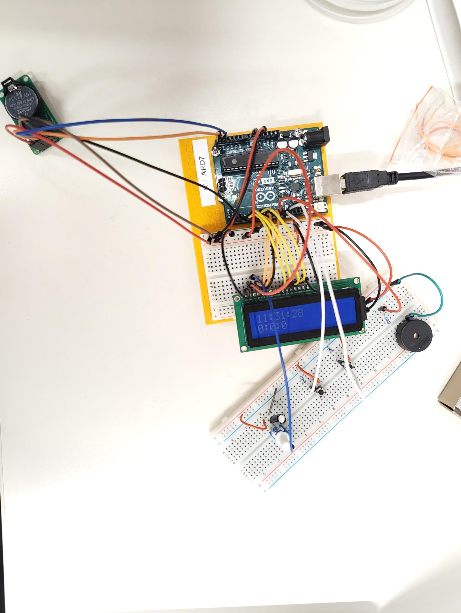

# mpp_alarm_clock

We built an arduino alarm clock that can be controlled by two buttons. 

The following parts are needed to recreate:
* Arduino Uno R3
* 16x2 LC Display with 16 Pin interface
* DS1302 RTC Module
* Piezo Buzzer 
* basic electronic parts (jumper wires, resistors, buttons, potientometer, capacitor)

*created by Frederik Alpers, Lea Plümacher*